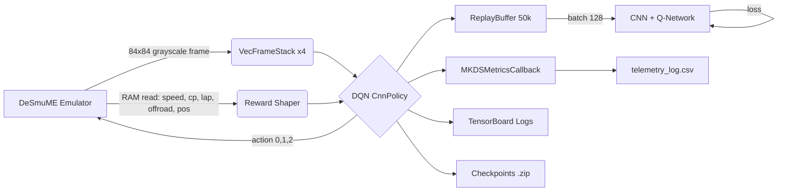

<div align="center">

# Mario Kart DS RL Agent
**Autonomous racing with Deep Q-Networks and real-time emulator telemetry.**

[](https://www.python.org/downloads/) [](https://pytorch.org/) [](https://stable-baselines3.readthedocs.io/) [](https://gymnasium.farama.org/) [](https://pypi.org/project/py-desmume/) [](https://opensource.org/licenses/MIT)

A Reinforcement Learning agent for **Mario Kart DS** developed as part of the course INF412 Autonomous Agents (2025–2026), at Technical University of Crete.

[Architecture](#architecture) • [Features](#features) • [Getting Started](#getting-started) • [Training](#training) • [Evaluation](#evaluation) • [Analysis](#analysis) • [Changelog](#changelog) • [License](#license)

</div>

---

## Overview

This project implements an autonomous RL agent for **Mario Kart DS** using **Deep Q-Networks (DQN)** with a **CNN policy**. The agent learns to drive the Figure-8 Circuit (Time Trials) using only the emulated top-screen as visual input, augmented by low-level telemetry read directly from NDS RAM via the `py-desmume` library for dense reward shaping.

The agent operates a discrete action space of three inputs: accelerate, accelerate + steer left, and accelerate + steer right. The agent is trained end-to-end using Stable Baselines3 with a frame-stacked CNN observation.

## Features

- **Visual observation**: 84×84 grayscale top-screen crops, stacked 4 frames deep for temporal context.
- **RAM telemetry**: Accessing direct NDS memory reads for speed, position, checkpoint, lap count, and surface type (on-road vs. off-road).
- **Shaped reward**: 4 orthogonal watchdogs (backward driving, timeout, collision, stuck) plus continuous speed reward and checkpoint bonuses.
- **Multi-instance training** for faster results.
- **Telemetry logging**: per-step CSV export of speed, position, action, and terminal reason for post-hoc analysis.
- **TensorBoard integration**: full SB3 scalar logging; multi-run comparison plots included.

## Architecture



## Repository Structure

```text
.
├── env/
│   └── mkds_gym_env.py         # MKDSEnv — core Gymnasium environment
├── src/
│   └── utils/
│       ├── config.py           # All hyperparameters, RAM addresses, paths
│       ├── callbacks.py        # SB3 callbacks (CSV telemetry logger)
│       └── ram_vars_testing.py # Standalone RAM inspector / manual driver
├── analysis/
│   ├── plot_generator.py       # Spatial heatmaps & action distribution plots
│   └── tf_event_parser.py      # TensorBoard events → CSV / comparison plots
├── train_sb3_dqn.py            # Main training entry-point (SB3 DQN)
├── demo.py                     # Evaluate / watch the agent drive
├── requirements.txt            # Pinned Python dependencies
├── mkds_boot.dst               # DeSmuME save state (race start position)
├── rom/                        # Place your Mario Kart DS ROM here (git-ignored)
├── outputs/                    # Trained models & plots (git-ignored)
└── logs/                       # TensorBoard logs (git-ignored)
```

---

## Getting Started

### Prerequisites

Ensure you have the following available:
- **Python 3.12.x**
- **CUDA-capable GPU** (recommended; CPU training is possible but slow)
- A legal copy of **Mario Kart DS (USA ROM)** in `.nds` format

Clone the repository and set up the environment:

```bash
git clone https://github.com/Asterinos1/Mario-Kart-DS-RL-Agent.git
cd Mario-Kart-DS-RL-Agent
```

Create and activate a Python virtual environment (recommended):

```bash
python -m venv mkds_venv
mkds_venv\Scripts\activate   # Windows
```

Install all dependencies:

```bash
pip install -r requirements.txt
```

Place your Mario Kart DS ROM (USA version) in the `rom/` directory:

```
rom/<your-file>.nds
```

The emulator will locate it automatically.

---

## Training

The agent trains on the **Figure-8 Circuit** using a pre-loaded DeSmuME save state (`mkds_boot.dst`) that places the kart at the race start position.

```bash
python train_sb3_dqn.py
```

On startup, the script scans `outputs/` for existing runs and offers an interactive resume menu. Press **Enter** to start a fresh run, or enter a run index to resume from the latest checkpoint (model + replay buffer are restored).

| Parameter | Value |
|---|---|
| Algorithm | DQN (`CnnPolicy`) |
| Observation | 84×84 grayscale, 4-frame stack |
| Action space | Discrete(3) — straight, left, right |
| Replay buffer | 50,000 transitions |
| Batch size | 128 |
| Discount (γ) | 0.99 |
| Learning rate | 0.00025 |
| Parallel envs | 4 (`SubprocVecEnv`) |
| Checkpoint freq | Every 10,000 steps |

Training can be safely interrupted at any time with **Ctrl+C**. An interupted run can be resumed later.

Monitor training live with TensorBoard:

```bash
tensorboard --logdir logs/
```

---

## Evaluation

Once a model has been trained (or partially trained), watch the agent drive autonomously:

```bash
python demo.py
```

The script presents a numbered list of all `.zip` checkpoints found in `outputs/`. Select one, and a DeSmuME window will open showing the agent driving. Episode count and cumulative reward are printed to the terminal after each episode ends.


---

## Analysis

### Telemetry Plots

Generate spatial heatmaps, action distributions, termination reason breakdowns, and cumulative reward curves from the per-run CSV telemetry log:

```bash
python analysis/plot_generator.py
```

Plots are saved to `outputs/<run_id>/plots/`.

| Plot | Description |
|---|---|
| `heatmap.png` | KDE density map of kart position over the track |
| `actions.png` | Bar chart of action frequency (Gas / Gas+Left / Gas+Right) |
| `reasons.png` | Pie chart of episode termination reasons |
| `speed_offroad.png` | Speed vs. off-road modifier scatter |
| `cumulative_reward.png` | Total reward accumulated over training steps |

### Learning Curves

Parse TensorBoard event files and generate high-fidelity training plots, including multi-run comparisons:

```bash
python analysis/tf_event_parser.py
```

Select a single run for individual plots, or select **0** to overlay all runs on a single comparison chart. Plots are saved to `outputs/<run_id>/plots/` or `analysis/plots/comparison/`.

---


## License

This project is licensed under the MIT License. See the [LICENSE](LICENSE) file for more details.

---

## Authors

| [<br /><sub><b>Asterinos1</b></sub>](https://github.com/Asterinos1) |
| :---: |

Developed for ΠΛΗ 412: Autonomous Agents at the Technical University of Crete.
